# Edge Gateway AI + HaLow — Diagrama de Bloques y Requerimientos Funcionales

**Proyecto:** Edge Gateway con IA para Smart City  
**Referencia:** Seeed Studio reComputer R1000  
**Fecha:** 2025-02-20  
**Revisión:** 0.2 (Actualización mayor — decisiones de usuario incorporadas)

---

## 1. Resumen de Decisiones Arquitectónicas

| Decisión | Selección | Justificación |
|---|---|---|
| **SoC** | **Raspberry Pi CM5 (BCM2712)** | Cortex-A76 @ 2.4GHz, 16GB RAM, USB 3.0, RP1 southbridge, conector CM4 compatible |
| **OS** | **OpenWRT** (custom image para CM5/BCM2712) | Requerido por OpenWISP agent + LuCI nativo |
| **Gestión de flota** | **OpenWISP** (Controller + Monitoring + Firmware Upgrader) | Gestión centralizada de decenas/cientos de gateways Smart City |
| **HaLow Module** | **Seeed Wio-WM6108** (Quectel FGH100M-H / MM6108 SoC) — mini-PCIe, **SPI**, US915 | Módulo disponible ($14.90), driver SPI binario disponible |
| **Mesh** | **802.11s** sobre HaLow — HWMP routing, target **>10 gateways** | open80211s soporta hasta ~32 nodos; 802.11ah es PHY compatible |
| **AI / Analytics** | **Thingsboard Edge** CE — Rule Engine local + sidecar ML | Plataforma IoT completa: alarmas, dashboards, data filtering, sync con cloud |
| **PCIe** | NVMe SSD en **Gen 3 x1** (fase 1), PCIe switch + Hailo (fase 2) | Estrategia escalonada |
| **Antenas** | BLE + Wi-Fi 2.4GHz → **integradas (PCB/radomo)**; HaLow, LoRa, 4G → **SMA externas** | Minimiza puntos de falla IP65 manteniendo potencia en sub-GHz |
| **Espectro HaLow** | **902-928 MHz (US/FCC Part 15)** — banda ISM 915 MHz | Viable en Colombia (banda ISM compartida) |
| **Alimentación** | DC industrial 9-36V + PoE 802.3at | Despliegue en infraestructura urbana |

---

## 2. Diagrama de Bloques (CM5 — Arquitectura Final)

```mermaid
graph TB
    subgraph POWER["⚡ POWER SUBSYSTEM"]
        PWR_IN["DC Input\n9-36V DC"]
        POE_MOD["PoE PD Module\nIEEE 802.3at 25.5W"]
        VREG["Voltage Regulators\n5V / 3.3V / 1.8V"]
        UPS["SuperCap UPS\nLTC3350\n>30s shutdown"]
        PWR_IN --> VREG
        POE_MOD --> VREG
        UPS --- VREG
    end

    subgraph CORE["🧠 CORE — CM5 (BCM2712)"]
        BCM["BCM2712\nQuad Cortex-A76 @ 2.4GHz\n16GB LPDDR4X\n64GB eMMC\nOpenWRT + OpenWISP"]
        RP1["RP1 Southbridge\nUSB3 · ETH · SPI · I2C · UART · GPIO"]
        BCM ===|"Dedicated\nPCIe internal"| RP1
    end

    subgraph STORAGE["💾 STORAGE"]
        EMMC["eMMC 64GB\nOS + firmware\n343 MB/s"]
        SSD["NVMe M.2 2280\n256GB-1TB\nPCIe Gen3 x1\n768 MB/s"]
    end

    subgraph HALOW["📡 Wi-Fi HaLow 802.11ah"]
        MM["Wio-WM6108\nQuectel FGH100M-H\n902-928 MHz US915\nAP + Mesh 802.11s"]
        ANT_HALOW["Antena HaLow\nSMA Sub-GHz"]
        MM --- ANT_HALOW
    end

    subgraph WIFI_BT["📶 Wi-Fi / BLE"]
        WIFI["On-chip Wi-Fi ac\n2.4/5 GHz"]
        BLE["On-chip BLE 5.0"]
        ANT_WIFI["Antena Integrada\nPCB / Radomo"]
        WIFI --- ANT_WIFI
        BLE --- ANT_WIFI
    end

    subgraph LORA["📻 LoRaWAN"]
        LORA_MOD["WM1302 LoRa\nSPI — US915"]
        ANT_LORA["Antena LoRa\nSMA 915 MHz"]
        LORA_MOD --- ANT_LORA
    end

    subgraph CELLULAR["📱 CELLULAR WAN"]
        LTE["4G LTE\nQuectel EC25\nUSB 3.0"]
        SIM["SIM Slot"]
        ANT_4G["Antena 4G+GPS\nSMA"]
        LTE --- SIM
        LTE --- ANT_4G
    end

    subgraph MESH_IOT["🔗 MESH IoT"]
        ZIG["Zigbee 3.0 / Thread\nUSB dongle"]
        ANT_ZIG["Antena Integrada\nPCB 2.4GHz"]
        ZIG --- ANT_ZIG
    end

    subgraph ETH["🌐 ETHERNET"]
        ETH0["ETH0 GbE\nvia RP1\nPoE PD + PTP"]
    end

    subgraph INDUSTRIAL["🏭 INTERFACES INDUSTRIALES"]
        RS485_1["RS485 Ch1\nAislado"]
        RS485_2["RS485 Ch2\nAislado"]
    end

    subgraph SECURITY["🔐 SEGURIDAD"]
        TPM["TPM 2.0\nSLB9670\nSPI"]
        ATECC["ATECC608A\nI2C"]
    end

    subgraph PERIPH["🔧 PERIFÉRICOS"]
        RTC["RTC + CR2032"]
        WDT["HW Watchdog"]
        LEDS["Status LEDs\nPWR·ACT·HaLow·WAN·ERR"]
        GPIO_EXP["PCA9535\nGPIO Expander I2C"]
    end

    subgraph AI_PLATFORM["🤖 AI / IoT PLATFORM"]
        TB_EDGE["Thingsboard Edge CE\nRule Engine local\nAlarmas · Dashboards\nData filtering"]
        ML_SIDECAR["ML Sidecar (Python)\nTFLite / ONNX\nAnomaly Detection\nPredictive Maint."]
        OPENWISP["OpenWISP Agent\nopenwisp-config\nopenwisp-monitoring"]
        TB_EDGE ---|"REST API\nlocalhost"| ML_SIDECAR
    end

    %% === CONNECTIONS ===

    %% Power
    VREG ==>|"5V / 3.3V"| BCM

    %% Storage
    BCM ---|"eMMC bus"| EMMC
    BCM ===|"PCIe Gen3 x1\n(external)"| SSD

    %% HaLow via SPI (RP1) — mini-PCIe
    RP1 ===|"SPI bus 1\n(mini-PCIe)"| MM

    %% WiFi/BLE on-chip
    BCM ---|"SDIO"| WIFI
    BCM ---|"Internal"| BLE

    %% LoRa via SPI (RP1)
    RP1 ---|"SPI bus 2"| LORA_MOD

    %% 4G via USB 3.0 (RP1)
    RP1 ---|"USB 3.0"| LTE

    %% Zigbee via USB (RP1)
    RP1 ---|"USB 3.0"| ZIG

    %% Ethernet via RP1
    RP1 ---|"GbE MAC"| ETH0
    ETH0 ---|"PoE In"| POE_MOD

    %% Industrial via RP1 UART
    RP1 ---|"UART"| RS485_1
    RP1 ---|"UART"| RS485_2

    %% Security via RP1
    RP1 ---|"SPI bus 3"| TPM
    RP1 ---|"I2C"| ATECC

    %% Peripherals via RP1
    RP1 ---|"I2C"| RTC
    RP1 ---|"I2C"| GPIO_EXP
    RP1 ---|"I2C"| WDT
    RP1 ---|"GPIO"| LEDS

    %% Software Platform
    BCM -.-|"Software"| TB_EDGE
    BCM -.-|"Software"| ML_SIDECAR
    BCM -.-|"Software"| OPENWISP

    %% Styling
    classDef core fill:#1a5276,stroke:#fff,color:#fff,stroke-width:3px
    classDef rp1 fill:#2c3e50,stroke:#3498db,color:#fff,stroke-width:2px
    classDef halow fill:#e74c3c,stroke:#fff,color:#fff,stroke-width:3px
    classDef wireless fill:#27ae60,stroke:#333,color:#fff
    classDef power fill:#f39c12,stroke:#333,color:#000
    classDef storage fill:#8e44ad,stroke:#fff,color:#fff
    classDef security fill:#c0392b,stroke:#fff,color:#fff
    classDef ai fill:#2980b9,stroke:#fff,color:#fff
    classDef mgmt fill:#16a085,stroke:#fff,color:#fff

    class BCM core
    class RP1 rp1
    class MM,ANT_HALOW halow
    class WIFI,BLE,ANT_WIFI,LORA_MOD,ANT_LORA,LTE,SIM,ANT_4G,ZIG,ANT_ZIG wireless
    class PWR_IN,POE_MOD,VREG,UPS power
    class EMMC,SSD storage
    class TPM,ATECC security
    class TB_EDGE,ML_SIDECAR ai
    class OPENWISP mgmt
```



---

## 3. Módulo HaLow: Seeed Wio-WM6108

### 3.1 Ficha Técnica

| Parámetro | Valor |
|---|---|
| **Módulo** | Seeed Wio-WM6108 (SKU 109990565) |
| **Chipset** | Quectel FGH100M-H (basado en Morse Micro MM6108 SoC) |
| **Form Factor** | Mini-PCIe (full-size) |
| **Interfaz seleccionada** | **SPI** (variante US915-SPI) |
| **Banda** | 902-928 MHz (FCC Part 15, US ISM) |
| **Canales** | 26 canales de 1 MHz ó 13 de 2 MHz en 902-928 MHz |
| **Data Rate (1 SS, 2 MHz)** | 0.65 – 8.67 Mbps (MCS0-MCS9) |
| **Data Rate típico IoT** | 1-4 Mbps (MCS3-4, rango medio) |
| **Alcance** | >1 km outdoor LOS, ~300m NLOS urbano |
| **Max clientes por AP** | Hasta 8,192 (spec 802.11ah), práctico ~200-500 |
| **Mesh** | 802.11s compatible (802.11ah como PHY subyacente) |
| **Seguridad** | WPA3-SAE (802.11ah nativo) |
| **Precio** | $14.90 (unidad), $14.50 (10+) |
| **Driver** | Binario SPI disponible (proporcionado por fabricante) |
| **Variantes disponibles** | US915-SPI, US915-USB, EU868-SPI, EU868-USB |

### 3.2 Conexión Mini-PCIe SPI

El módulo Wio-WM6108 en variante SPI usa los pines del conector mini-PCIe mapeados así:

| Pin mini-PCIe | Señal | Conexión RP1 |
|---|---|---|
| Pin 23, 25, 31, 33 | SPI CLK, MOSI, MISO, CS | RP1 SPI bus 1 |
| Pin 35, 37 | IRQ, RESET | RP1 GPIO |
| Pin 2, 4, ... | GND, 3.3V | Power rail |

> **Nota:** El driver binario SPI elimina la necesidad de portar el driver completo al kernel de OpenWRT. Solo se necesita un wrapper/loader para el .bin y configurar el device-tree del SPI en RP1.

---

## 4. Topología Mesh: 802.11s sobre HaLow

### 4.1 Arquitectura de Red

```
                    ┌─────────────────┐
                    │   CLOUD          │
                    │  Thingsboard     │
                    │  Server          │
                    │  + OpenWISP      │
                    │  Controller      │
                    └────────┬────────┘
                             │ VPN (WireGuard)
                             │ 4G LTE / Ethernet
                    ┌────────┴────────┐
                    │  GATEWAY #1      │
                    │  (Root Mesh AP)  │
                    │  ETH + 4G WAN   │
                    └───┬─────────┬───┘
               HaLow   │         │  HaLow
              802.11s   │         │  802.11s
           ┌────────────┴──┐  ┌──┴────────────┐
           │  GATEWAY #2   │  │  GATEWAY #3    │
           │  (Mesh Peer)  │  │  (Mesh Peer)   │
           └──┬─────────┬──┘  └──┬──────────┬──┘
              │         │        │          │
         HaLow│    HaLow│   HaLow│     HaLow│
              │         │        │          │
        ┌─────┴──┐ ┌────┴──┐ ┌──┴────┐ ┌───┴────┐
        │  GW #4 │ │ GW #5 │ │ GW #6 │ │ GW #7  │
        └────────┘ └───────┘ └───────┘ └────────┘
              ▼         ▼        ▼          ▼
          [Sensores IoT HaLow — hasta 200+ por gateway]
```

### 4.2 Parámetros Mesh

| Parámetro | Valor | Notas |
|---|---|---|
| **Protocolo Mesh** | IEEE 802.11s (HWMP — Hybrid Wireless Mesh Protocol) | Default en Linux mac80211 |
| **PHY** | IEEE 802.11ah (Wi-Fi HaLow) sobre 902-928 MHz | Sub-GHz = mayor alcance mesh |
| **Target nodos mesh** | **>10 gateways** (objetivo mínimo viable) | >10 ya es un logro |
| **Máximo teórico (open80211s)** | ~32 nodos mesh | Límite práctico de open80211s en Linux |
| **Max hops (relay)** | 2 hops (spec 802.11ah relay AP) | Más hops posibles con 802.11s HWMP |
| **Channel planning** | 26 canales de 1 MHz disponibles en 902-928 MHz | Asignar canales no-overlapping a mesh peers |
| **Backhaul inter-gateway** | HaLow mesh (SPI, ~2-4 Mbps efectivos) | Suficiente para telemetría IoT agregada |
| **Backhaul a cloud** | ETH GbE ó 4G LTE por gateway con WAN | Solo gateways "root" necesitan WAN |
| **Routing** | HWMP (on-demand + tree-based) | Soportado nativamente en OpenWRT |

### 4.3 Channel Planning (902-928 MHz)

```
902 MHz                                              928 MHz
  |  1  2  3  4  5  6  7  8  9  10 11 12 13  ...  26 |
  |  ╠══╬══╬══╬══╬══╬══╬══╬══╬══╬══╬══╬══╬══╬══╬══╣  |
  |     1 MHz channels (26 total)                      |

  Mesh backbone:  Ch 1, 5, 9, 13 (non-overlapping 2MHz)
  Client access:  Ch restantes (asignados por gateway)
```

---

## 5. Asignación de Buses e Interfaces (CM5 / RP1)

| Bus / Interfaz | Recurso | Dispositivo | Notas |
|---|---|---|---|
| **PCIe Gen3 x1** (BCM2712 externo) | M.2 Key M | NVMe SSD 256GB-1TB | Único lane externo. Gen 3 = 768 MB/s |
| **PCIe interno** (BCM2712 → RP1) | Dedicado | RP1 Southbridge | Enlace fijo SoC ↔ RP1 |
| **SDIO** (BCM2712) | Wi-Fi on-chip | BCM43455 Wi-Fi ac + BLE 5.0 | No disponible para HaLow |
| **SPI bus 1** (RP1) | Mini-PCIe slot | **Wio-WM6108 HaLow (SPI)** | Driver binario SPI |
| **SPI bus 2** (RP1) | Dedicado | WM1302 LoRa SPI | |
| **SPI bus 3** (RP1) | Dedicado | TPM 2.0 (SLB9670) | |
| **USB 3.0 Port 1** (RP1) | Directo | 4G LTE (Quectel EC25) | 5 Gbps, sin saturar |
| **USB 3.0 Port 2** (RP1) | Directo | Zigbee/Thread USB dongle | 5 Gbps |
| **USB 2.0** (RP1) | Consola | USB-C Debug/Flash | |
| **UART 1** (RP1) | RS485 Ch1 | Transceiver aislado + DE/RE GPIO | |
| **UART 2** (RP1) | RS485 Ch2 | Transceiver aislado + DE/RE GPIO | |
| **I2C** (RP1) | Bus compartido | RTC + PCA9535 + ATECC608A + WDT | |
| **GbE MAC** (RP1) | ETH0 | PHY GbE (BCM54210 o integrado RP1) | PoE PD + IEEE 1588 PTP |
| **GPIO** (RP1) | Varios | LEDs, Buzzer, RS485 DE/RE, UPS alarm, WM6108 IRQ/RST | |
| **eMMC** (BCM2712) | Interno | 64GB eMMC | OS + firmware |

> **Ventaja CM5/RP1:** 3 buses SPI independientes permiten HaLow, LoRa y TPM **sin conflictos**. Imposible en CM4.

---

## 6. Requerimientos Funcionales

### 6.1 RF — Conectividad de Red

| ID | Requerimiento | Prioridad | Notas |
|---|---|---|---|
| **RF-NET-001** | El gateway DEBE funcionar como AP Wi-Fi HaLow (802.11ah) en banda 902-928 MHz | MUST | Wio-WM6108, alcance >1km |
| **RF-NET-002** | El gateway DEBE soportar mesh 802.11s sobre HaLow entre gateways vecinos | MUST | HWMP routing, target >10 gateways en la red |
| **RF-NET-003** | El gateway DEBE soportar al menos 50 clientes HaLow simultáneos | MUST | Sensores IoT urbanos |
| **RF-NET-004** | La red mesh DEBE soportar un mínimo de 10 gateways interconectados | MUST | open80211s soporta hasta ~32 nodos |
| **RF-NET-005** | El gateway DEBE proveer conectividad Wi-Fi 5 (802.11ac) 2.4/5GHz | MUST | CM5 on-chip, para dispositivos estándar/provisioning |
| **RF-NET-006** | El gateway DEBE soportar uplink 4G LTE como WAN | MUST | Quectel EC25 via USB 3.0 |
| **RF-NET-007** | El gateway DEBE funcionar como Gateway LoRaWAN (US915) | MUST | WM1302 SPI, Packet Forwarder |
| **RF-NET-008** | El gateway DEBE soportar BLE 5.0 para provisioning y beacons | SHOULD | CM5 on-chip |
| **RF-NET-009** | El gateway DEBE soportar Zigbee 3.0 / Thread como coordinator | SHOULD | USB dongle via USB 3.0 |
| **RF-NET-010** | El gateway DEBE tener 1x Gigabit Ethernet con soporte PoE PD | MUST | ETH0 via RP1 |
| **RF-NET-011** | El gateway DEBERÍA soportar IEEE 1588 PTP para sincronización de tiempo | SHOULD | Crítico para correlación de datos Smart City |
| **RF-NET-012** | El gateway DEBE soportar VLANs para segmentación de tráfico IoT | MUST | OpenWRT nativo |
| **RF-NET-013** | El channel planning del mesh DEBE usar canales no-overlapping para backbone | MUST | 2 MHz channels en 902-928 MHz (13 disponibles) |
| **RF-NET-014** | El backhaul mesh inter-gateway DEBE soportar al menos 2 Mbps efectivos | SHOULD | Suficiente para telemetría IoT agregada |

### 6.2 RF — Inteligencia Artificial / Analytics (Thingsboard Edge)

| ID | Requerimiento | Prioridad | Notas |
|---|---|---|---|
| **RF-AI-001** | El gateway DEBE ejecutar **Thingsboard Edge CE** como plataforma IoT local | MUST | Java, requiere ≥4GB RAM (CM5 16GB OK) |
| **RF-AI-002** | TB Edge DEBE procesar telemetría localmente via Rule Engine (data filtering, alarmas) | MUST | Reduce tráfico WAN, respuesta <1s local |
| **RF-AI-003** | TB Edge DEBE generar alarmas locales basadas en umbrales y reglas configurables | MUST | Sin dependencia de conectividad cloud |
| **RF-AI-004** | TB Edge DEBE sincronizar datos filtrados/agregados con Thingsboard Cloud Server | MUST | Sync bidireccional: data↑, configs/dashboards↓ |
| **RF-AI-005** | TB Edge DEBE proveer dashboards locales accesibles sin internet | MUST | UI local en http://gateway:18080 |
| **RF-AI-006** | El gateway DEBE ejecutar un **sidecar ML** (Python + TFLite/ONNX) para analytics avanzados | SHOULD | Anomaly detection, predictive maintenance |
| **RF-AI-007** | TB Edge DEBE invocar el sidecar ML via **REST API node** en el Rule Engine | SHOULD | Rule chain: telemetry → REST call → ML inference → alarm/action |
| **RF-AI-008** | El sidecar ML DEBE ejecutar modelos de detección de anomalías en <100ms | SHOULD | Cortex-A76 @ 2.4GHz, ~10ms estimado |
| **RF-AI-009** | El gateway DEBE cachear datos de sensores en SSD cuando no haya conectividad WAN | MUST | TB Edge tiene store-and-forward nativo |
| **RF-AI-010** | El gateway DEBE soportar actualización OTA de modelos ML y reglas TB Edge | SHOULD | Via OpenWISP firmware + TB Edge cloud sync |

### 6.3 RF — Sistema Operativo y Gestión

| ID | Requerimiento | Prioridad | Notas |
|---|---|---|---|
| **RF-OS-001** | El gateway DEBE correr **OpenWRT** como sistema operativo base | MUST | Requerido para OpenWISP agents |
| **RF-OS-002** | El gateway DEBE incluir **OpenWISP agents** (openwisp-config + openwisp-monitoring) | MUST | Gestión centralizada de flota Smart City |
| **RF-OS-003** | La flota DEBE gestionarse desde **OpenWISP Controller** centralizado | MUST | Config management, VPN provisioning, monitoring |
| **RF-OS-004** | El gateway DEBE proveer interfaz web **LuCI** para configuración local | MUST | Firewall, DHCP, VPN, QoS, VLAN |
| **RF-OS-005** | OpenWISP DEBE gestionar: configuración de red, firmware updates, monitoreo, topología mesh | MUST | Controller + Monitoring + Firmware Upgrader + Network Topology |
| **RF-OS-006** | El gateway DEBE soportar VPN **WireGuard** para backhaul seguro a cloud/OpenWISP | MUST | OpenWISP usa WireGuard para tunnel management |
| **RF-OS-007** | El gateway DEBE soportar actualización de firmware OTA via **OpenWISP Firmware Upgrader** | MUST | Dual-partition para failsafe |
| **RF-OS-008** | El gateway DEBE soportar containers (LXC/Docker) para TB Edge y sidecar ML | MUST | Aislar Java (TB Edge) y Python (ML) del OS base |
| **RF-OS-009** | El gateway DEBE soportar MQTT broker local (Mosquitto) | MUST | Para agregación de datos IoT locales |
| **RF-OS-010** | OpenWRT DEBE portarse a **CM5/BCM2712 + RP1** | MUST | ⚠️ Esfuerzo de porting requerido. Ver §9 Riesgos. |

### 6.4 RF — Interfaces Industriales

| ID | Requerimiento | Prioridad | Notas |
|---|---|---|---|
| **RF-IND-001** | El gateway DEBE tener al menos 2x RS485 aislados galvánicamente | SHOULD | Sensores industriales Smart City |
| **RF-IND-002** | El gateway DEBE soportar protocolo Modbus RTU/TCP | SHOULD | Integración con medidores, actuadores |
| **RF-IND-003** | El gateway DEBERÍA soportar protocolo BACnet | COULD | Si se usa en edificios inteligentes |

### 6.5 RF — Alimentación y Protección

| ID | Requerimiento | Prioridad | Notas |
|---|---|---|---|
| **RF-PWR-001** | El gateway DEBE aceptar alimentación DC 9-36V | MUST | Rango industrial |
| **RF-PWR-002** | El gateway DEBE soportar alimentación **PoE IEEE 802.3at** (25.5W) | MUST | Cubre peak de ~17W con margen |
| **RF-PWR-003** | El gateway DEBE incluir UPS por supercapacitor para shutdown seguro (>30s) | SHOULD | LTC3350 |
| **RF-PWR-004** | El consumo total NO DEBE exceder 25W en ningún escenario | MUST | Límite PoE 802.3at |
| **RF-PWR-005** | El gateway DEBE tener protección contra sobretensión (>40V) | MUST | TVS diodes |
| **RF-PWR-006** | El gateway DEBE tener protección de polaridad inversa | MUST | MOSFET protection |

### 6.6 RF — Seguridad

| ID | Requerimiento | Prioridad | Notas |
|---|---|---|---|
| **RF-SEC-001** | El gateway DEBE incluir TPM 2.0 para secure boot y almacenamiento de claves | MUST | SLB9670 via SPI (RP1 bus 3) |
| **RF-SEC-002** | El gateway DEBE incluir crypto element ATECC608A para authenticación IoT | SHOULD | Certificados X.509, device identity |
| **RF-SEC-003** | El gateway DEBE soportar cifrado TLS 1.3 para comunicaciones WAN | MUST | TB Edge ↔ Cloud, OpenWISP ↔ Controller |
| **RF-SEC-004** | El gateway DEBE soportar firewall stateful (nftables) | MUST | OpenWRT nativo |
| **RF-SEC-005** | El gateway DEBE aislar tráfico entre redes IoT (HaLow, LoRa, Zigbee) y WAN | MUST | VLANs + firewall zones |
| **RF-SEC-006** | La red mesh HaLow DEBE usar **WPA3-SAE** para autenticación peer | MUST | Nativo en 802.11ah |

### 6.7 RF — Ambiental, Mecánico y Antenas

| ID | Requerimiento | Prioridad | Notas |
|---|---|---|---|
| **RF-MEC-001** | El gateway DEBE operar en rango **-30°C a +70°C** | MUST | Smart City outdoor |
| **RF-MEC-002** | El gateway DEBE tener protección **IP65** o superior | MUST | Outdoor |
| **RF-MEC-003** | El gateway DEBE cumplir EMC: ESD Level 3, EFT Level 2, Surge Level 2 | MUST | EN61000-4-2/4/5 |
| **RF-MEC-004** | El gateway DEBE soportar montaje en **poste, DIN-rail y pared** | MUST | Smart City: postes, gabinetes, fachadas |
| **RF-MEC-005** | La carcasa DEBE ser aluminio con disipación pasiva (fanless) | MUST | Sin partes móviles |
| **RF-MEC-006** | Antenas BLE y Wi-Fi 2.4GHz DEBEN ser **integradas** (PCB o radomo plástico) | MUST | Minimiza penetraciones IP65 |
| **RF-MEC-007** | Antenas HaLow, LoRa, y 4G DEBEN usar conectores **SMA con sellado IP67** | MUST | Potencia y sub-GHz requieren antena externa |
| **RF-MEC-008** | El gateway DEBE tener LEDs de estado visibles externamente | MUST | PWR, ACT, HaLow, WAN, Error |
| **RF-MEC-009** | Dimensiones DEBEN ser ≤ 200 x 150 x 60 mm | SHOULD | Comparable a R1000 |
| **RF-MEC-010** | Máximo **3 conectores SMA** externos (HaLow + LoRa + 4G) | SHOULD | Minimizar puntos de falla sellado |

### 6.8 RF — Confiabilidad

| ID | Requerimiento | Prioridad | Notas |
|---|---|---|---|
| **RF-REL-001** | El gateway DEBE incluir hardware watchdog independiente | MUST | Auto-reboot en crash |
| **RF-REL-002** | El gateway DEBE incluir RTC con batería de respaldo CR2032 | MUST | Timestamp sin NTP |
| **RF-REL-003** | El gateway DEBE soportar dual-partition boot para failsafe firmware update | MUST | OpenWRT sysupgrade + OpenWISP |
| **RF-REL-004** | El gateway DEBE logear eventos y errores en almacenamiento persistente (SSD) | MUST | TB Edge + syslog |
| **RF-REL-005** | MTBF objetivo: >50,000 horas | SHOULD | ~5.7 años |

---

## 7. Stack de Software

### 7.1 Arquitectura de Capas

```
┌──────────────────────────────────────────────────────────────┐
│                    MANAGEMENT PLANE                           │
│  OpenWISP Controller (remoto) ←→ openwisp-config (local)     │
│  OpenWISP Monitoring  ←→ openwisp-monitoring (local)         │
│  OpenWISP Firmware Upgrader                                  │
│  OpenWISP Network Topology (mesh visualization)              │
├──────────────────────────────────────────────────────────────┤
│                    APPLICATION PLANE                          │
│  ┌─────────────────────────┐  ┌────────────────────────────┐ │
│  │  Thingsboard Edge CE    │  │  ML Sidecar (Container)    │ │
│  │  ─────────────────────  │  │  ────────────────────────  │ │
│  │  Rule Engine             │  │  Python 3.11               │ │
│  │  Device Management       │  │  TFLite Runtime            │ │
│  │  Dashboards (local)      │  │  ONNX Runtime              │ │
│  │  Alarms & Notifications  │←REST→│  Anomaly Detection     │ │
│  │  MQTT Transport          │  │  Predictive Maintenance    │ │
│  │  Store & Forward         │  │  REST API (Flask/FastAPI)  │ │
│  │  Cloud Sync (gRPC)       │  │                            │ │
│  └─────────────────────────┘  └────────────────────────────┘ │
├──────────────────────────────────────────────────────────────┤
│                    NETWORKING PLANE (OpenWRT)                 │
│  LuCI · nftables · dnsmasq · hostapd · WireGuard             │
│  802.11s mesh (wpa_supplicant) · HaLow SPI driver            │
│  Mosquitto MQTT broker · LoRa Packet Forwarder               │
│  VLAN isolation · QoS · DHCP · DNS                           │
├──────────────────────────────────────────────────────────────┤
│                    KERNEL / DRIVERS                           │
│  Linux 6.6+ · OpenWRT kernel · RP1 drivers                   │
│  mac80211 (802.11s mesh) · SPI driver (WM6108 .bin)          │
│  USB3 (xHCI) · NVMe · RS485 (ttyAMA) · I2C · GPIO           │
├──────────────────────────────────────────────────────────────┤
│                    HARDWARE (CM5 + Carrier Board)             │
│  BCM2712 + RP1 · eMMC · NVMe · WM6108 · WM1302              │
│  EC25 4G · Zigbee USB · RS485 · TPM · ATECC · RTC           │
└──────────────────────────────────────────────────────────────┘
```

### 7.2 Flujo de Datos IoT

```
Sensor IoT ──HaLow──→ Gateway AP ──MQTT──→ Thingsboard Edge
                                              │
                                    ┌─────────┴──────────┐
                                    │ Rule Engine (local) │
                                    ├─────────────────────┤
                                    │ 1. Save to DB local │
                                    │ 2. Check thresholds │
                                    │ 3. ──REST──→ ML     │
                                    │    Sidecar           │
                                    │    (anomaly score)  │
                                    │ 4. Generate alarm?  │
                                    │ 5. Filter → Cloud   │
                                    └─────────┬──────────┘
                                              │ gRPC sync
                                              ▼
                                    Thingsboard Cloud Server
                                    (dashboards, históricos,
                                     alertas, reporting)
```

### 7.3 OpenWISP — Gestión de Flota

| Módulo OpenWISP | Función en el Gateway | Protocolo |
|---|---|---|
| **openwisp-config** | Recibe y aplica configuración de red (firewall, VLAN, WireGuard, interfaces) | HTTPS + JSON |
| **openwisp-monitoring** | Reporta métricas (CPU, RAM, WiFi clients, ping, traffic, mesh topology) | HTTPS |
| **Firmware Upgrader** | Recibe y aplica actualizaciones de firmware OpenWRT | HTTPS |
| **Network Topology** | Exporta topología mesh 802.11s para visualización centralizada | HTTPS + netJSON |
| **Controller** | Gestión centralizada: templates de config, VPN provisioning, device groups | Django REST API |

---

## 8. Presupuesto de Potencia Estimado (CM5)

| Componente | Consumo Típico | Consumo Máximo | Notas |
|---|---|---|---|
| CM5 (BCM2712, 4 cores active) | 2.7W | 6.7W | Idle 2.65W, full load 6.66W |
| NVMe SSD | 1.0W | 3.0W | Depende del modelo |
| Wio-WM6108 (HaLow SPI) | 0.5W | 1.5W | TX mode AP+Mesh |
| 4G LTE (Quectel EC25) | 1.0W | 3.5W | Transmitting |
| LoRa WM1302 | 0.3W | 0.8W | |
| Zigbee USB dongle | 0.1W | 0.3W | |
| RS485 transceivers (x2) | 0.2W | 0.4W | |
| TPM + ATECC + RTC + misc | 0.2W | 0.3W | |
| LEDs + Watchdog | 0.1W | 0.2W | |
| **TOTAL** | **~6.1W** | **~16.7W** | ✅ Dentro de PoE 802.3at (25.5W) |

> **✅ Solucionado:** Con PoE 802.3at (25.5W) hay margen suficiente incluso en carga máxima (~17W). Duty-cycling de radios reduce aún más el consumo promedio.

---

## 9. Riesgos Técnicos y Mitigaciones

### 🔴 RIESGO CRÍTICO: Porting OpenWRT a CM5 (BCM2712 + RP1)

**Problema:** OpenWRT no tiene soporte oficial para BCM2712 + RP1 southbridge. El target `bcm27xx` soporta CM4/BCM2711 pero no CM5.

**Impacto:** Bloquea el uso de OpenWISP agents (requieren OpenWRT).

**Mitigación:**
1. Monitorear el trabajo de la comunidad OpenWRT para BCM2712 (Pi 5 es masivamente popular → soporte llegará)
2. **Plan B:** Iniciar desarrollo con CM4/OpenWRT (soporte experimental existente), migrar a CM5 cuando esté disponible
3. **Plan C:** Portar los OpenWISP agents (`openwisp-config` es Lua/shell, `openwisp-monitoring` es Lua/shell) a Raspberry Pi OS — esfuerzo moderado ya que son scripts, no binarios
4. **Timing:** Si el porting no existe en 6 meses, considerar contribuir al upstream de OpenWRT

### 🟡 RIESGO MEDIO: Driver HaLow SPI en OpenWRT

**Problema:** El driver binario SPI del Wio-WM6108 está disponible pero debe integrarse en el build system de OpenWRT (kernel module + device-tree overlay para RP1 SPI).

**Mitigación:**
- El binario SPI simplifica enormemente vs portar un driver completo
- Crear paquete OpenWRT (.ipk) que cargue el módulo kernel + configure device-tree
- Integrar con mac80211 para soporte 802.11s mesh
- **Prioridad:** Contactar Seeed/Quectel para documentación de integración del .bin

### 🟡 RIESGO MEDIO: 802.11s Mesh sobre 802.11ah

**Problema:** 802.11s (mesh) está diseñado para operar sobre 802.11a/b/g/n/ac/ah/ax como PHY subyacente. Sin embargo, la implementación práctica de 802.11s sobre 802.11ah es relativamente nueva y depende del driver.

**Mitigación:**
- open80211s soporta hasta ~32 nodos mesh — nuestro target de >10 es conservador
- HWMP routing es el default y está bien probado en Linux
- Validar con el EVK de Morse Micro / Wio-WM6108 antes del diseño final del carrier board
- Channel planning con canales no-overlapping de 2MHz reduce interferencia

### 🟡 RIESGO MEDIO: Thingsboard Edge + Docker en OpenWRT

**Problema:** TB Edge es una aplicación Java que requiere ≥1GB RAM y Docker/LXC. OpenWRT tiene soporte limitado para Docker.

**Mitigación:**
- CM5 con 16GB RAM tiene capacidad de sobra
- OpenWRT soporta LXC containers nativamente — correr TB Edge en Alpine/Debian LXC
- Alternativa: Docker en overlay (paquete `dockerd` existe para OpenWRT)
- TB Edge CE requiere: Java 17+ , PostgreSQL o Cassandra (usar PostgreSQL en container)

### ~~🟢 RESUELTO: Regulación HaLow en Colombia~~

**Resolución:** Se usará la banda ISM 902-928 MHz (FCC Part 15, US) que es compartida y regulada en Colombia por la ANE. La banda 915 MHz ISM está disponible para uso sin licencia en la región 2 de ITU (Américas).

> **Nota:** Verificar límites de potencia TX permitidos por ANE para la banda 902-928 MHz en Colombia. FCC permite hasta +30 dBm EIRP para spread spectrum.

### 🟢 RIESGO BAJO: Antenas y Sellado IP65

**Resolución parcial:** Estrategia de antenas mixta:
- **Integradas (PCB/radomo):** BLE + Wi-Fi 2.4GHz → 0 conectores SMA adicionales
- **SMA externas:** Solo 3 conectores: HaLow sub-GHz + LoRa 915MHz + 4G/GPS
- Conectores SMA con rating IP67, sellos de O-ring, cable glands industriales

---

## 10. Comparativa: R1000 vs. Edge Gateway HaLow Propuesto (Rev 0.2)

| Característica | reComputer R1000 | Gateway HaLow (CM5) | Delta |
|---|---|---|---|
| **SoC** | CM4 (BCM2711, A72) | **CM5 (BCM2712, A76)** | **Upgrade: 2-3x CPU** |
| **RAM** | 4-8 GB | **16 GB** | **2-4x** |
| **OS** | RPi OS / Ubuntu | **OpenWRT (custom)** | Cambio mayor |
| **Gestión** | SSH / Manual | **OpenWISP centralizado** | **NUEVO** |
| **IoT Platform** | ❌ No | **Thingsboard Edge CE** | **NUEVO** |
| **Wi-Fi HaLow** | ❌ No | **Wio-WM6108 (SPI)** | **NUEVO** |
| **Mesh** | ❌ No | **802.11s HaLow (>10 GW)** | **NUEVO** |
| **Wi-Fi estándar** | On-chip (ac) | On-chip (ac) | Igual |
| **LoRaWAN** | Opcional (Mini-PCIe) | ✅ Incluido (SPI) | Integrado |
| **4G LTE** | Opcional (Mini-PCIe) | ✅ Incluido (USB 3.0) | Integrado |
| **Zigbee/Thread** | Opcional (USB) | ✅ Incluido (USB 3.0) | Integrado |
| **BLE** | On-chip | On-chip | Igual |
| **AI local** | ❌ No | **TB Edge Rule Engine + ML sidecar** | **NUEVO** |
| **NVMe SSD** | Opcional (M.2) | ✅ PCIe Gen 3 (768 MB/s) | **Upgrade** |
| **RS485** | 3x aislados | 2x aislados | Simplificado |
| **IP Rating** | IP40 (indoor) | **IP65 (outdoor)** | **Upgrade** |
| **PoE** | 802.3af opcional | **802.3at integrado** | Upgrade |
| **Antenas** | Todas SMA | **Mixtas: integradas + SMA** | Optimizado |
| **Montaje** | DIN-rail / Pared | **Poste / DIN-rail / Pared** | Ampliado |
| **UPS** | SuperCap opcional | SuperCap integrado | Integrado |
| **USB** | 2.0 (hub) | **3.0 nativo (2 puertos)** | **Upgrade** |
| **Longevidad** | Hasta 2034 | **Hasta 2036** | +2 años |

---

## 11. Referencia: Análisis CM4 → CM5

### 11.1 Especificaciones CM5 vs CM4

| Parámetro | CM4 (BCM2711) | CM5 (BCM2712) | Mejora |
|---|---|---|---|
| **CPU** | 4x Cortex-A72 @ 1.5GHz | 4x Cortex-A76 @ 2.4GHz | **~2-3x rendimiento** |
| **GPU** | VideoCore VI @ 500MHz | VideoCore VII @ 800MHz | ~1.6x |
| **RAM máxima** | 8 GB LPDDR4 | **16 GB** LPDDR4X-4267 | **2x capacidad** |
| **eMMC máxima** | 32 GB | **64 GB** | 2x |
| **PCIe externo** | Gen 2 x1 (5 Gbps) | Gen 2 x1 oficial, **Gen 3 x1 posible** (~8 Gbps) | ~1.6x BW |
| **USB** | 1x USB 2.0 (nativo) | **2x USB 3.0** (5 Gbps c/u) + 1x USB 2.0 | **Salto enorme** |
| **Southbridge** | No (todo directo del SoC) | **RP1** (USB, ETH, GPIO, SPI, I2C) | Nueva arquitectura |
| **SPI controllers** | SPI0 (2 CS), SPI1-6 (limitados) | RP1 expone **múltiples SPI** (5-6 buses) | **Más SPI disponibles** |
| **Form Factor** | 55 x 40 mm, 2x 100-pin | 55 x 40 mm, 2x 100-pin | **Compatible** |
| **Consumo idle** | ~2.88W | ~2.65W | Ligeramente mejor |
| **Consumo full load** | ~5.52W | ~6.66W | +1.1W |
| **Precio (8GB/32GB/WiFi)** | ~$75 | ~$90 | +$15 |
| **Producción hasta** | 2034 | **2036** | +2 años |

### 11.2 ¿CM5 Resuelve los Problemas del CM4?

| Problema | CM4 Status | CM5 Status | Veredicto |
|---|---|---|---|
| **SDIO Wi-Fi vs HaLow** | 🔴 Conflicto directo | 🟢 SPI via RP1 (múltiples buses) | **Resuelto** |
| **PCIe SSD + Hailo** | 🔴 1 lane Gen 2 | 🟡 1 lane Gen 3, switch viable | **Mitigado** |
| **AI en CPU** | 🔴 A72 lento, 8GB max | 🟢 A76 ~2-3x, **16GB RAM** | **Resuelto** |
| **USB bandwidth** | 🟡 Todo via USB 2.0 hub | 🟢 **2x USB 3.0 nativos** | **Resuelto** |
| **OpenWRT** | 🟡 Soporte experimental | 🔴 Sin soporte aún | **Peor (temporal)** |

### 11.3 Benchmark AI Estimado

| Modelo AI | CM4 (A72 @ 1.5GHz) | CM5 (A76 @ 2.4GHz) | Speedup |
|---|---|---|---|
| MobileNet v2 (TFLite, int8) | ~25 ms | ~10 ms | **~2.5x** |
| LSTM anomaly (ONNX, float32) | ~50 ms | ~18 ms | **~2.8x** |
| Random Forest (100 trees) | ~8 ms | ~3 ms | **~2.7x** |

---

## 12. Próximos Pasos

| # | Tarea | Prioridad | Bloqueante | Estado |
|---|---|---|---|---|
| 1 | Validar límites de potencia TX 902-928 MHz en Colombia con ANE/CRC | Alta | Sí — afecta alcance HaLow | ☐ |
| 2 | Probar Wio-WM6108 SPI con CM5 Dev Kit — validar driver .bin + 802.11s mesh | Crítica | Sí — core del producto | ☐ |
| 3 | Prototipar OpenWRT en CM5 (o CM4 fallback) — validar feasibility del porting | Crítica | Sí — determina OS final | ☐ |
| 4 | Instalar OpenWISP Controller en servidor de prueba + configurar agents OpenWRT | Alta | No | ☐ |
| 5 | Instalar Thingsboard Edge CE en CM5 (Docker/LXC) — validar Rule Engine + dashboards | Alta | No | ☐ |
| 6 | Prototipar sidecar ML: REST API + TFLite anomaly model → integrar con TB Edge Rule Chain | Media | No — depende de #5 | ☐ |
| 7 | Mapear buses SPI del RP1 para asignar: HaLow (bus 1), LoRa (bus 2), TPM (bus 3) | Alta | No — depende de #2 | ☐ |
| 8 | Diseñar carrier board CM5: mini-PCIe (HaLow), SPI (LoRa, TPM), USB 3.0, RS485, PoE, antenas | Alta | Depende de #2, #3 | ☐ |
| 9 | Estimar **BOM cost** del gateway completo | Alta | Depende de #8 | ☐ |
| 10 | Definir channel planning mesh para despliegue de >10 gateways en área piloto | Media | No | ☐ |
