# Análisis R1000 → Edge Gateway HaLow (CM4)

**Proyecto:** Edge Gateway con IA para Smart City  
**Base:** Seeed Studio reComputer R1000 (CM4 R101)  
**Fecha:** 2025-02-20  
**Revisión:** 0.1

---

## 1. Decisión: CM4 en lugar de CM5

| Factor | CM5 (BCM2712) | CM4 (BCM2711) | Veredicto |
|---|---|---|---|
| **OpenWRT** | 🔴 Sin soporte (BCM2712 + RP1) | 🟡 Soporte experimental (`bcm27xx`) | **CM4 gana** — OpenWRT funcional hoy |
| **OpenWISP agents** | 🔴 Bloqueado por OpenWRT | 🟢 Funcional con OpenWRT | **CM4 gana** |
| **CPU** | 4x A76 @ 2.4GHz | 4x A72 @ 1.5GHz | CM5 ~2-3x más rápido |
| **RAM máxima** | 16 GB | 8 GB | CM5 tiene más |
| **USB** | 2x USB 3.0 nativos | 1x USB 2.0 nativo (via hub) | CM5 mejor |
| **SPI** | RP1: 5-6 buses SPI | SPI0-SPI6 (multiplexados GPIO) | CM5 más limpio |
| **PCIe** | Gen 3 x1 | Gen 2 x1 | CM5 +60% BW |
| **Carrier board** | Diseño nuevo requerido | **R1000 como base** | **CM4 gana** — HW existente |
| **Time-to-market** | >12 meses (porting + HW nuevo) | **~3-6 meses** (mod del R1000) | **CM4 gana** |
| **Comunidad / soporte** | Nuevo, poca documentación | Maduro, amplia documentación | **CM4 gana** |
| **Producción** | Hasta 2036 | Hasta 2034 | CM5 +2 años |

> **Conclusión:** CM4 + OpenWRT es viable HOY. CM5 requiere porting de OpenWRT que puede tomar 6-12+ meses. El R1000 provee un carrier board probado sobre el cual podemos iterar. **Iniciar con CM4; migrar a CM5 cuando OpenWRT lo soporte.**

---

## 2. Variante CM4 Requerida

| Parámetro | Selección | Justificación |
|---|---|---|
| **Modelo** | **CM4108032** | 8GB RAM + 32GB eMMC + WiFi |
| **RAM** | **8 GB** | TB Edge (≥4GB) + ML sidecar ~1GB + OpenWRT ~512MB + buffer |
| **eMMC** | **32 GB** | OpenWRT (~256MB) + containers (TB Edge ~2GB, ML ~1GB) + firmware + logs. Datos en NVMe SSD. |
| **WiFi** | **Sí** (on-chip BCM43455 802.11ac + BLE 5.0) | Requerido para provisioning, Wi-Fi estándar, BLE beacons |
| **Precio** | ~**$75 USD** | |
| **Disponibilidad** | ✅ En stock (producción hasta 2034) | |

> **Nota:** 4GB RAM NO es suficiente. TB Edge CE requiere ≥1GB heap de Java + PostgreSQL ~512MB + ML sidecar Python ~512MB + OpenWRT + headroom. Con 4GB queda sin margen.

---

## 3. Mapa del Esquemático R1000 (CM4 R101)

### 3.1 Páginas del Esquemático Identificadas

| Pág | Circuito | Para HaLow GW | Acción |
|---|---|---|---|
| 01-07 | CM4 Module + Power Supply (DC-DC, LDOs) | Esencial | ✅ **MANTENER** |
| **08** | USB 2.0 Switch & RST Button | Esencial | ✅ **MANTENER** |
| **09** | USB 2.0 HUB1 (USB2514BI — 4 puertos) | Parcial | 🔄 **MODIFICAR** — quitar LAN9512 downstream |
| **10** | USB HUB2 (USB2512B) & USB Type-A | No necesario | ❌ **ELIMINAR** |
| **11** | HDMI (2x connectors + ESD) | No necesario | ❌ **ELIMINAR** |
| **12** | IO Expander & 10/100M Ethernet (LAN9512) | No necesario | ❌ **ELIMINAR** |
| **13** | Type-C Debug (USB-to-UART) | Esencial (desarrollo) | ✅ **MANTENER** |
| **14** | RTC (DS1339) & Encryption (ATECC) & EEPROM | Esencial | ✅ **MANTENER** |
| **15** | Mini-PCIe (LoRa WM1302 & LTE EG25-G & Zigbee) | Crítico | 🔄 **MODIFICAR** — agregar HaLow |
| 16-17 | RS485 (x3) & CAN bus & GPIO & misc | Parcial | 🔄 **MODIFICAR** — quitar CAN, reducir RS485 a 2 |
| **18** | Gigabit PoE (PD, 802.3at) | Esencial | ✅ **MANTENER** |
| 19 | UPS (SuperCap) | Esencial | ✅ **MANTENER** |
| **20** | M.2 Key-M NVMe SSD (PCIe Gen2 x1) | Esencial | ✅ **MANTENER** |

### 3.2 ICs Principales del R1000

| IC | Función | En R1000 | Para HaLow GW | Acción |
|---|---|---|---|---|
| **USB2514BI** | USB 2.0 Hub (4 puertos) | HUB1 — downstream de CM4 USB | Necesario para 4G, Zigbee | ✅ MANTENER |
| **USB2512B** | USB 2.0 Hub (2 puertos) | HUB2 — USB Type-A | No necesario | ❌ ELIMINAR |
| **LAN9512** | USB Hub + 10/100M Ethernet | Puerto ETH secundario | No necesario (GbE nativo basta) | ❌ ELIMINAR |
| **RTL8153-CG** | USB 3.0 → GbE | GbE alternativo | No necesario | ❌ ELIMINAR |
| **VL805-Q6** | PCIe → USB 3.0 Host | USB 3.0 vía PCIe | No necesario (PCIe → NVMe) | ❌ ELIMINAR |
| **RTL8111** | PCIe GbE PHY | Ethernet alternativo | No necesario | ❌ ELIMINAR |
| **WL1835MOD** | TI WiLink8 WiFi/BT | WiFi adicional | No necesario (CM4 on-chip) | ❌ ELIMINAR |
| **WM8960** | Audio Codec (Wolfson) | Salida audio | No necesario | ❌ ELIMINAR |
| **TLV320AIC3104** | Audio Codec (TI) | Audio alternativo | No necesario | ❌ ELIMINAR |
| **SP3232EEA** | RS232 Transceiver | Debug serial | No necesario (USB debug) | ❌ ELIMINAR |
| CAN controller | CAN bus | Industrial | No en requerimientos | ❌ ELIMINAR |
| CAN transceiver | CAN bus | Industrial | No en requerimientos | ❌ ELIMINAR |
| RS485 transceiver #3 | 3er canal RS485 | Industrial | Solo necesitamos 2 | ❌ ELIMINAR |
| **DS1339** | RTC | Timekeeping | Esencial | ✅ MANTENER |
| **ATECC608** | Crypto Element (I2C) | Seguridad IoT | Esencial | ✅ MANTENER |
| **HC32L130E8PA** | MCU Cortex-M0+ (HDSC) | Watchdog, GPIO, LEDs | Esencial | ✅ MANTENER |
| **TPS2514BI** | USB Power Switches (x5) | Power control | Reducir a lo necesario | 🔄 REDUCIR |
| **TXS0108E** | Level Translator 8-bit | I/O levels | Mantener si es necesario | ✅ MANTENER |
| **TPS54302** | Buck 3A | Power supply | Esencial | ✅ MANTENER |
| **SY8088/SY8089** | Buck regulators | Power supply | Esencial | ✅ MANTENER |
| **XC6206/XC6217/XC6228** | LDOs (1.8V, 3.3V) | Power supply | Esencial | ✅ MANTENER |
| TPM 2.0 | Secure boot | Seguridad | Esencial | ✅ MANTENER |

---

## 4. Arquitectura de Buses CM4 para HaLow

### 4.1 El Problema SDIO (Resuelto)

```
CM4 BCM2711 SDIO Bus
       │
       ▼
  [On-chip WiFi BCM43455]  ← OCUPADO (WL_SDIO_CLK/CMD/D0-D3)
       │
       ✗ NO disponible para HaLow
```

**Solución:** El Wio-WM6108 tiene variante **SPI** (US915-SPI). No necesitamos SDIO.

### 4.2 Asignación de SPI en CM4 (BCM2711)

El BCM2711 tiene múltiples controladores SPI accesibles vía los conectores de 200 pines del CM4:

| Bus SPI | GPIOs | Chip Selects | Asignación propuesta | Device |
|---|---|---|---|---|
| **SPI0** | GPIO 8-11 | **CE0** (GPIO 8) | WM1302 LoRa (SX1302) | ← ya en R1000 |
| | | **CE1** (GPIO 7) | **TPM 2.0** (SLB9670) | NUEVO |
| **SPI1** | GPIO 16-21 | **CE0** (GPIO 18) | **Wio-WM6108 HaLow** | NUEVO |
| | | CE1 (GPIO 17) | Reservado | |
| | | CE2 (GPIO 16) | Reservado | |

**SPI1 para HaLow → conexión vía mini-PCIe:**

```
CM4 BCM2711 SPI1
  ┌──────────────────┐
  │ SPI1_SCLK (GPIO21) ──→ mini-PCIe Pin 23 (CLK)
  │ SPI1_MOSI (GPIO20) ──→ mini-PCIe Pin 25 (MOSI)
  │ SPI1_MISO (GPIO19) ──→ mini-PCIe Pin 31 (MISO)
  │ SPI1_CE0  (GPIO18) ──→ mini-PCIe Pin 33 (CS)
  │ GPIO_xx            ──→ mini-PCIe Pin 35 (IRQ)
  │ GPIO_yy            ──→ mini-PCIe Pin 37 (RESET)
  └──────────────────┘
        │
        ▼
  ┌──────────────────┐
  │  Wio-WM6108      │
  │  (SPI variant)   │
  │  902-928 MHz     │
  │  HaLow AP+Mesh   │
  └──────────────────┘
```

> **Nota:** SPI1 GPIOs 16-21 están en el CM4 HAT connector. No conflictan con SPI0 (GPIOs 7-11) ni con SDIO WiFi. Se requiere device-tree overlay: `dtoverlay=spi1-1cs,cs0_pin=18`.

### 4.3 PCIe Gen2 x1 — Directo a NVMe

```
CM4 BCM2711 PCIe Gen2 x1 (5 Gbps)
       │
       ▼
  ┌──────────────────┐
  │ M.2 Key-M (NVMe) │  ← Ruta directa, NO pasa por VL805
  │ 256GB - 1TB SSD  │
  │ ~500 MB/s        │
  └──────────────────┘
```

El R1000 ya tiene M.2 Key-M conectado al PCIe del CM4 (Página 20 del esquemático). **Mantener sin cambios.**

> **Importante:** Al eliminar VL805 (PCIe → USB 3.0), el PCIe queda 100% dedicado al NVMe SSD. Los dispositivos USB (4G, Zigbee) funcionan perfectamente en USB 2.0 (480 Mbps >> 150 Mbps del 4G LTE).

### 4.4 USB 2.0 — Arquitectura de Hub

```
CM4 USB 2.0 (único puerto nativo)
       │
       ▼
  ┌──────────────────────────────┐
  │    USB2514BI (HUB1)          │
  │    4-port USB 2.0 Hub        │
  │    (mantener del R1000)      │
  └──┬────┬────┬────┬───────────┘
     │    │    │    │
     ▼    ▼    ▼    ▼
   EG25  WM1302 Zigbee  Libre/
   4G    LoRa   USB     Debug
   LTE   (USB   dongle
   (mPCIe variant)
    USB)
```

**Cambios vs R1000:**
- ❌ Quitar LAN9512 (USB Hub + 10/100M ETH) del downstream
- ❌ Quitar USB2512B (HUB2) y USB Type-A
- ✅ Mantener mini-PCIe para EG25-G (4G) — usa líneas USB del mini-PCIe
- 🔄 LoRa: cambiar de SPI (mini-PCIe compartido) a **USB variant** (WM1302 MCU/USB) conectado al hub
  - Esto libera el slot mini-PCIe SPI para HaLow

### 4.5 Asignación Final de Buses

| Bus / Interfaz | Hardware | Señales CM4 | Notas |
|---|---|---|---|
| **SDIO** | On-chip WiFi ac + BLE 5.0 | WL_SDIO_* | Ocupado por WiFi — NO tocar |
| **SPI0 CE0** | WM1302 LoRa (SX1302) | GPIO 8-11 | Mantener del R1000 |
| **SPI0 CE1** | TPM 2.0 (SLB9670) | GPIO 7, 9-11 | NUEVO — compartir bus SPI0 |
| **SPI1 CE0** | **Wio-WM6108 HaLow** (via mini-PCIe) | GPIO 16-21 | **NUEVO — core del proyecto** |
| **PCIe Gen2 x1** | M.2 NVMe SSD (256GB-1TB) | PCIe lanes | Mantener del R1000 |
| **USB 2.0 Hub Port 1** | EG25-G 4G LTE (via mini-PCIe USB) | USB2514BI downstream | Mantener del R1000 |
| **USB 2.0 Hub Port 2** | WM1302 LoRa (**USB variant**) | USB2514BI downstream | 🔄 Cambiar de SPI a USB |
| **USB 2.0 Hub Port 3** | Zigbee/Thread USB dongle | USB2514BI downstream | Mantener del R1000 |
| **USB 2.0 Hub Port 4** | Libre (expansión futura) | USB2514BI downstream | Nuevo |
| **GbE nativo** | CM4 → RJ45 + PoE PD 802.3at | RGMII | Mantener del R1000 |
| **I2C** | RTC + ATECC608A + IO Expander | GPIO 2-3 | Mantener del R1000 |
| **UART 0** | USB-C Debug console | GPIO 14-15 | Mantener del R1000 |
| **UART 3** | RS485 Ch1 (aislado) | GPIO 4-5 | Mantener del R1000 |
| **UART 4** | RS485 Ch2 (aislado) | GPIO 8-9 ó 12-13 | Mantener del R1000 |
| **GPIO** | LEDs, Buzzer, RS485 DE/RE, IRQ HaLow, RST HaLow | Varios | Ajustar asignación |
| **eMMC** | 32GB interno | Directo SoC | OS + firmware |

---

## 5. Qué Eliminar y Por Qué

### 5.1 Circuitos a Eliminar

| # | Circuito | ICs involucrados | Razón de eliminación | Ahorro BOM est. |
|---|---|---|---|---|
| 1 | **HDMI** (2x puertos) | Conectores HDMI + ESD (TPD4S012) + level shifters | Gateway sin display. Diagnóstico via web (LuCI/TB Edge). | ~$5-8 |
| 2 | **Audio codec** | WM8960 ó TLV320AIC3104 + audio jack + speaker circuit | No hay casos de uso de audio en el gateway. | ~$4-6 |
| 3 | **WiFi extra** (WL1835MOD) | TI WiLink8 module + antena + matching | CM4 ya tiene WiFi ac + BLE 5.0 on-chip. Redundante. | ~$10-15 |
| 4 | **USB HUB2 + Type-A** | USB2512B + 2x USB Type-A connectors + ESD | No necesitamos puertos USB externos. Todo va por HUB1 interno. | ~$3-5 |
| 5 | **10/100M Ethernet** (sec.) | LAN9512 + RJ45 + magnetics + ESD | Un puerto GbE (nativo CM4) es suficiente. | ~$6-10 |
| 6 | **RS232** | SP3232EEA + connector | Debug es por USB-C (UART). No necesitamos RS232 legacy. | ~$2-3 |
| 7 | **CAN bus** | CAN controller + CAN transceiver (MCP2515 o similar) | No está en los requerimientos Smart City actuales. | ~$4-6 |
| 8 | **RS485 tercer canal** | 1x RS485 transceiver + connector | Solo necesitamos 2 canales RS485. | ~$2-3 |
| 9 | **microSD slot** | Connector + ESD + level shifter | CM4 con eMMC 32GB + NVMe SSD. No necesitamos SD. | ~$1-2 |
| 10 | **VL805 USB 3.0** | VL805-Q6 + crystal + passives | PCIe va directo a NVMe. USB 2.0 suficiente para periféricos. | ~$5-7 |
| 11 | **RTL8153/RTL8111** | USB/PCIe GbE PHY + magnetics | GbE nativo del CM4 es suficiente. | ~$4-6 |
| | **TOTAL estimado** | | | **~$46-71** |

### 5.2 Lo que se conserva del R1000

| # | Circuito | ICs | Razón |
|---|---|---|---|
| 1 | **CM4 connectors** | FX23L-100S (2x100-pin Hirose) | Base del SoM |
| 2 | **Power supply** | TPS54302 buck + SY8088/89 + XC6206/6217/6228 LDOs + TPS2121 ORing | Alimentación probada |
| 3 | **USB HUB1** | USB2514BI (4-port USB 2.0) | Hub para 4G, LoRa USB, Zigbee |
| 4 | **Mini-PCIe #1** | 52-pin connector | → **Wio-WM6108 HaLow (SPI1)** |
| 5 | **Mini-PCIe #2** (EG25-G) | 52-pin connector + SIM holder | 4G LTE (USB) |
| 6 | **M.2 NVMe SSD** | M.2 Key-M 67-pin + PCIe routing | Almacenamiento TB Edge |
| 7 | **GbE + PoE** | CM4 nativo + 802.3at PD module + RJ45 con magnéticos | Alimentación + red |
| 8 | **RTC** | DS1339 + CR2032 | Timekeeping sin NTP |
| 9 | **Crypto** | ATECC608A (I2C) | Device identity, X.509 |
| 10 | **TPM 2.0** | SLB9670 (SPI0 CE1) | Secure boot, key storage |
| 11 | **MCU co-procesador** | HC32L130E8PA (Cortex-M0+) | Watchdog HW, GPIO expander, LEDs |
| 12 | **RS485 x2** | TP485E (x2) + aislamiento galvánico | Sensores industriales |
| 13 | **USB-C Debug** | USB-to-UART bridge | Consola serial para desarrollo |
| 14 | **UPS SuperCap** | LTC3350 ó equivalente | Shutdown seguro >30s |
| 15 | **ESD protection** | USBLC6-2P6, NUP4114, TPD4E05U06 | Protección de puertos |
| 16 | **Level translators** | TXS0108E | Conversión niveles 1.8V↔3.3V |
| 17 | **Antena 2.4GHz** | PCB antenna integrada | BLE + WiFi |

### 5.3 Modificaciones al R1000

| # | Modificación | Detalle |
|---|---|---|
| 1 | **Mini-PCIe #1 → HaLow** | Remapear de SPI0 (LoRa) a **SPI1** (GPIO 16-21). Conectar Wio-WM6108. Agregar GPIOs para IRQ y RESET del WM6108. |
| 2 | **LoRa: SPI → USB** | Mover WM1302 de SPI (mini-PCIe) a **USB variant** (MCU/USB). Conectar al USB2514BI HUB1 puerto libre. Libera mini-PCIe para HaLow. |
| 3 | **SPI0 CE1 → TPM** | Agregar TPM 2.0 (SLB9670) en SPI0 CE1 (GPIO 7). Compartir bus SPI0 con LoRa (CE0). |
| 4 | **Agregar SMA HaLow** | Nuevo conector SMA IP67 para antena sub-GHz (902-928 MHz). Cable pigtail U.FL→SMA desde Wio-WM6108. |
| 5 | **Agregar SMA LoRa** | SMA IP67 para antena LoRa 915 MHz (si no existe ya en R1000). |
| 6 | **Enclosure → IP65** | Rediseñar carcasa: aluminio fanless, sellado IP65, montaje en poste. |
| 7 | **PoE → 802.3at** | Verificar que el PD module soporte 25.5W (802.3at) — no solo 802.3af (12.95W). |
| 8 | **Device-tree overlay** | Crear overlay para: SPI1 (HaLow), SPI0 CE1 (TPM), UIDs de GPIO para IRQ/RST. |

---

## 6. Diagrama de Bloques CM4 HaLow (Modificado del R1000)

```mermaid
graph TB
    subgraph POWER["⚡ POWER"]
        PWR_IN["DC 9-36V"]
        POE["PoE PD\n802.3at 25.5W"]
        VREG["TPS54302 Buck\n+ LDOs\n5V/3.3V/1.8V"]
        UPS["SuperCap UPS\n>30s"]
        PWR_IN --> VREG
        POE --> VREG
        UPS --- VREG
    end

    subgraph CM4["🧠 CM4 (BCM2711)"]
        SoC["BCM2711\nQuad A72 @ 1.5GHz\n8GB LPDDR4\n32GB eMMC"]
        WIFI_BT["On-chip WiFi ac\n+ BLE 5.0\n(SDIO — OCUPADO)"]
        SoC ---|"SDIO"| WIFI_BT
    end

    subgraph SPI_BUS["🔌 SPI BUSES"]
        SPI0["SPI0 (GPIO 7-11)"]
        SPI1["SPI1 (GPIO 16-21)"]
    end

    subgraph HALOW["📡 Wi-Fi HaLow — NUEVO"]
        WM6108["Wio-WM6108\nHaLow SPI\n902-928 MHz\nAP + Mesh 802.11s"]
        ANT_HL["SMA Sub-GHz\n(NUEVO)"]
        WM6108 --- ANT_HL
    end

    subgraph LORA["📻 LoRaWAN"]
        WM1302["WM1302 LoRa\nUSB variant\nUS915"]
        ANT_LR["SMA LoRa\n915 MHz"]
        WM1302 --- ANT_LR
    end

    subgraph SECURITY["🔐 SEGURIDAD"]
        TPM["TPM 2.0\nSLB9670\nSPI0 CE1"]
        ATECC["ATECC608A\nI2C"]
    end

    subgraph USB_TREE["🔌 USB 2.0 TREE"]
        HUB1["USB2514BI\n4-port HUB"]
        LTE["EG25-G 4G\nmini-PCIe USB"]
        ZIG["Zigbee/Thread\nUSB dongle"]
        SIM["Nano-SIM"]
        ANT_4G["SMA 4G+GPS"]
        LTE --- SIM
        LTE --- ANT_4G
    end

    subgraph STORAGE["💾 STORAGE"]
        EMMC["eMMC 32GB\nOS + firmware"]
        SSD["NVMe M.2\n256GB-1TB\nPCIe Gen2 x1"]
    end

    subgraph INDUSTRIAL["🏭 INDUSTRIAL"]
        RS485_1["RS485 Ch1\nAislado"]
        RS485_2["RS485 Ch2\nAislado"]
    end

    subgraph PERIPH["🔧 PERIFÉRICOS"]
        RTC["DS1339 RTC\n+ CR2032"]
        MCU["HC32L130\nWatchdog+GPIO+LED"]
        DEBUG["USB-C Debug"]
        ANT_WIFI["Antena Integrada\n2.4GHz PCB"]
    end

    subgraph SOFTWARE["🤖 SOFTWARE"]
        OPENWRT["OpenWRT\n+ LuCI"]
        OPENWISP["OpenWISP\nAgents"]
        TB_EDGE["Thingsboard\nEdge CE"]
        ML["ML Sidecar\nTFLite/ONNX"]
        TB_EDGE ---|"REST"| ML
    end

    %% Connections
    VREG ==>|"5V/3.3V"| SoC

    SoC ---|"eMMC bus"| EMMC
    SoC ===|"PCIe Gen2 x1"| SSD

    SoC --> SPI0
    SoC --> SPI1

    SPI1 ===|"SPI1 CE0\n(GPIO 16-21)"| WM6108
    SPI0 ---|"SPI0 CE0\n(GPIO 8-11)"| WM1302
    SPI0 ---|"SPI0 CE1\n(GPIO 7)"| TPM

    SoC ---|"USB 2.0"| HUB1
    HUB1 ---|"Port 1\nUSB"| LTE
    HUB1 ---|"Port 2\nUSB"| WM1302
    HUB1 ---|"Port 3\nUSB"| ZIG
    HUB1 ---|"Port 4"| DEBUG

    SoC ---|"GbE\nnativo"| POE

    SoC ---|"I2C"| ATECC
    SoC ---|"I2C"| RTC
    SoC ---|"I2C"| MCU
    SoC ---|"UART"| RS485_1
    SoC ---|"UART"| RS485_2

    WIFI_BT --- ANT_WIFI

    SoC -.-|"Software"| OPENWRT
    SoC -.-|"Software"| OPENWISP
    SoC -.-|"Software"| TB_EDGE
    SoC -.-|"Software"| ML

    classDef core fill:#1a5276,stroke:#fff,color:#fff,stroke-width:3px
    classDef halow fill:#e74c3c,stroke:#fff,color:#fff,stroke-width:3px
    classDef keep fill:#27ae60,stroke:#333,color:#fff
    classDef power fill:#f39c12,stroke:#333,color:#000
    classDef storage fill:#8e44ad,stroke:#fff,color:#fff
    classDef security fill:#c0392b,stroke:#fff,color:#fff
    classDef ai fill:#2980b9,stroke:#fff,color:#fff

    class SoC core
    class WM6108,ANT_HL halow
    class WIFI_BT,WM1302,ANT_LR,LTE,SIM,ANT_4G,ZIG,ANT_WIFI keep
    class PWR_IN,POE,VREG,UPS power
    class EMMC,SSD storage
    class TPM,ATECC security
    class TB_EDGE,ML,OPENWRT,OPENWISP ai
```



---

## 7. Limitaciones del CM4 vs CM5 — Impacto Real

| Limitación CM4 | Impacto en el Gateway | Mitigación | Severidad |
|---|---|---|---|
| **8GB RAM** (vs 16GB CM5) | TB Edge + ML sidecar + OpenWRT en ~8GB | Sufficient: TB Edge ~2GB, ML ~1GB, OpenWRT ~1GB, buffer ~4GB. **OK.** | 🟢 Bajo |
| **USB 2.0** (vs USB 3.0 CM5) | 4G LTE max ~150 Mbps; Zigbee ~250 kbps | USB 2.0 (480 Mbps) >> 4G throughput. Zigbee es bajo ancho de banda. **OK.** | 🟢 Bajo |
| **PCIe Gen2** (vs Gen3 CM5) | NVMe SSD max ~500 MB/s | Más que suficiente para IoT data logging y TB Edge DB. **OK.** | 🟢 Bajo |
| **SPI multiplexado** (vs RP1 dedicado CM5) | HaLow en SPI1, LoRa en SPI0, TPM en SPI0 CE1 | Funcional con device-tree overlays. Bus SPI0 compartido OK (baja frecuencia TPM). | 🟡 Medio |
| **CPU A72 @ 1.5GHz** (vs A76 @ 2.4GHz CM5) | ML inference ~25ms (vs ~10ms CM5) | 25ms es aceptable para anomaly detection. No es real-time. **OK.** | 🟢 Bajo |
| **LoRa en USB** (vs SPI dedicado) | Ligero overhead USB vs SPI directo | WM1302 USB variant es producto estándar de Seeed. Probado. **OK.** | 🟢 Bajo |

> **Veredicto:** Ninguna limitación del CM4 es un blocker para nuestro gateway. Las diferencias son de rendimiento, no de funcionalidad. La ventaja de tener OpenWRT + OpenWISP **hoy** supera ampliamente las ventajas de rendimiento del CM5.

---

## 8. SPI — Detalle de Compatibilidad

### 8.1 SPI0 del BCM2711 (LoRa + TPM)

```
          BCM2711 SPI0
     ┌────────────────────┐
     │  SCLK  = GPIO 11   │──────┬──────────→ WM1302 (SX1302_CSN)
     │  MOSI  = GPIO 10   │──────┤            LoRa Concentrator
     │  MISO  = GPIO  9   │──────┤
     │  CE0   = GPIO  8   │──────┘
     │                     │
     │  CE1   = GPIO  7   │──────────────────→ SLB9670 TPM 2.0
     └────────────────────┘
```

- LoRa (SX1302) y TPM comparten SCLK/MOSI/MISO
- Cada uno tiene su propio Chip Select (CE0, CE1) → no hay conflicto
- TPM accede al bus de forma esporádica (boot, key ops) → sin contención real con LoRa

### 8.2 SPI1 del BCM2711 (HaLow)

```
          BCM2711 SPI1
     ┌────────────────────┐
     │  SCLK  = GPIO 21   │──────────────────→ Wio-WM6108
     │  MOSI  = GPIO 20   │                    HaLow SPI
     │  MISO  = GPIO 19   │                    902-928 MHz
     │  CE0   = GPIO 18   │
     │                     │
     │  IRQ   = GPIO xx    │ (interrupt line)
     │  RST   = GPIO yy    │ (reset control)
     └────────────────────┘
```

- Bus SPI1 **100% dedicado** a HaLow → máximo throughput y mínima latencia
- SPI1 GPIOs (16-21) están en el conector HAT del CM4 → accesibles en el carrier board
- Requiere **device-tree overlay**: `dtoverlay=spi1-1cs`

### 8.3 Device Tree Overlays Necesarios

```dts
/* HaLow — SPI1 para Wio-WM6108 */
dtoverlay=spi1-1cs,cs0_pin=18,cs0_spidev=false

/* TPM — SPI0 CE1 */
dtoverlay=tpm-slb9670     /* Standard TPM overlay */

/* LoRa ya configurado en R1000 via SPI0 CE0 */
```

---

## 9. Ruta de Migración Futura CM4 → CM5

Cuando OpenWRT soporte BCM2712:

| Aspecto | Cambio necesario | Esfuerzo |
|---|---|---|
| **SoM swap** | CM4 → CM5 (mismo conector 200-pin) | Plug-and-play |
| **Carrier board** | Sin cambios — CM5 mantiene compatibilidad | Ninguno |
| **SPI mapping** | SPI0/SPI1 → RP1 SPI buses | Device-tree update |
| **PCIe** | Gen2 → Gen3 automático | Ninguno |
| **USB** | USB 2.0 hub → USB 3.0 nativo (posible eliminar hub) | Carrier board mod |
| **Software** | OpenWRT image para BCM2712 | Build system update |

> **La arquitectura del carrier board basada en R1000 es forward-compatible con CM5.** Solo se necesita cambiar el SoM y actualizar la imagen de OpenWRT.

---

## 10. BOM Resumido — Gateway HaLow (basado en R1000 modificado)

| # | Componente | Cantidad | Precio est. | Notas |
|---|---|---|---|---|
| 1 | CM4108032 (8GB/32GB/WiFi) | 1 | $75 | SoM |
| 2 | Wio-WM6108 (US915-SPI) | 1 | $15 | HaLow module |
| 3 | WM1302 LoRaWAN (USB variant) | 1 | $35 | LoRa concentrator |
| 4 | Quectel EG25-G (4G LTE) | 1 | $25 | Cellular WAN |
| 5 | NVMe SSD 256GB | 1 | $25 | Data storage |
| 6 | Carrier board (R1000 modificado) | 1 | $80-120 | PCB + componentes power/hub/ESD |
| 7 | Enclosure aluminio IP65 | 1 | $30-50 | Custom |
| 8 | PoE PD module 802.3at | 1 | $10-15 | |
| 9 | Antenas SMA x3 (HaLow+LoRa+4G) | 3 | $15-25 | Sub-GHz + 4G |
| 10 | SuperCap UPS module | 1 | $10-15 | |
| 11 | SIM card holder + SIM | 1 | $2 | |
| 12 | Misc (cables, connectors, packaging) | 1 | $15-25 | |
| | **TOTAL estimado (prototipo unitario)** | | **$337-427** | |
| | **TOTAL estimado (producción 100+ uds)** | | **$250-320** | Descuentos volumen |

> **Nota:** Esto es una estimación gruesa. El BOM detallado requiere selección final de componentes y cotización con distribuidores.

---

## 11. Próximos Pasos (Actualizados para CM4)

| # | Tarea | Prioridad | Bloqueante | Estado |
|---|---|---|---|---|
| 1 | **Probar Wio-WM6108 SPI en CM4 Dev Kit** — validar driver .bin + SPI1 overlay | Crítica | Sí — core | ☐ |
| 2 | **Compilar OpenWRT para CM4** (`bcm27xx` target) con SPI1 overlay | Crítica | Sí — OS | ☐ |
| 3 | **Validar 802.11s mesh** sobre HaLow entre 2+ CM4 boards | Crítica | Sí — mesh | ☐ |
| 4 | **Instalar TB Edge CE** en CM4/OpenWRT (LXC container, 8GB RAM) | Alta | No | ☐ |
| 5 | **Probar WM1302 USB** variant con OpenWRT (reemplaza SPI variant) | Alta | No | ☐ |
| 6 | Instalar OpenWISP agents en OpenWRT para CM4 | Alta | No | ☐ |
| 7 | **Obtener esquemático PDF** del R1000 y marcar circuitos a eliminar/modificar | Alta | No | ☐ |
| 8 | Diseñar device-tree overlays (SPI1 HaLow, SPI0 CE1 TPM) | Alta | Depende #1 | ☐ |
| 9 | Prototipar carrier board modificado (basado en R1000) | Media | Depende #1-3 | ☐ |
| 10 | Estimar BOM cost detallado con cotizaciones reales | Media | Depende #9 | ☐ |
