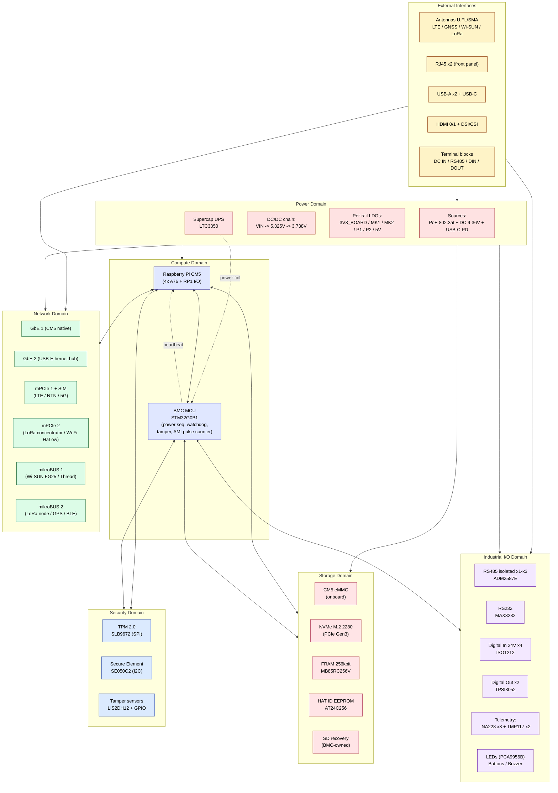
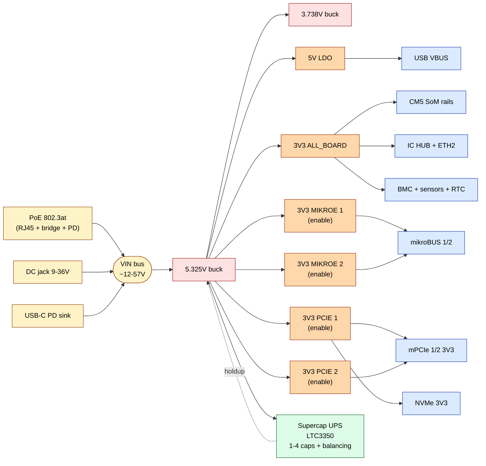

# CM5 Carrier — High-Level Block Diagram (HLBD)

Diagramas de arquitectura de la carrier industrial CM5 (edge gateway / AMI).
Cuatro vistas complementarias — todas renderizables como Mermaid en GitHub / VS Code (extension Markdown Preview Mermaid Support).

- **Schematic:** [CM5_Project_20260508.pdf](CM5_Project_20260508.pdf)
- **Checklist BoM:** [cm5-carrier-design-checklist.md](cm5-carrier-design-checklist.md)
- **Fecha:** 2026-05-28

---

## Vista 1 — Arquitectura general por dominios



**Lectura del diagrama:**
- El **BMC** se posiciona como peer del CM5, no como esclavo. Es el dueño de I²C industrial, supercap, watchdog, y E/S de campo.
- El CM5 conserva los buses de alta velocidad (PCIe Gen3 -> NVMe + mPCIe + USB hub, HDMI, DSI, CSI).
- La **seguridad** es accesible por ambos: TPM via SPI del CM5; SE050 compartido por I²C (con bus arbitration por GPIO).

---

## Vista 2 — Power Tree



**Notas del power tree:**
- 3 fuentes en OR -> VIN (PoE class 4 ~25W recomendado).
- LTC3350 entre V5 y el bus de holdup: cuando V5 cae, alimenta de regreso unos ~3-5 s, suficiente para que el BMC haga flush a FRAM y apague rieles secundarios.
- Cada bloque sensible tiene **su propio LDO con enable**, controlable desde el BMC -> permite apagado selectivo (ej. apagar mPCIe2 cuando no hay LoRa activo para ahorrar).
- INA228 en VIN, V5, y 3V3_BOARD -> el BMC publica al CM5 W/A/V por riel cada N segundos via I²C.

---

## Vista 3 — Topología de buses (quien habla con quien)

```mermaid
flowchart TB
    classDef cm5 fill:#e0e7ff,stroke:#3730a3,color:#000
    classDef bmc fill:#fef3c7,stroke:#92400e,color:#000
    classDef bus fill:#f3f4f6,stroke:#374151,color:#000
    classDef dev fill:#dcfce7,stroke:#166534,color:#000

    CM5["CM5 SoM"]:::cm5
    BMC["BMC STM32G0"]:::bmc

    I2C_CM5(["I2C0 CM5 (system)"]):::bus
    SPI_CM5(["SPI0 CM5 (TPM/HAT)"]):::bus
    I2C_BMC(["I2C BMC (industrial)"]):::bus
    SPI_BMC(["SPI BMC (storage)"]):::bus
    PCIE(["PCIe Gen3 (CM5 root)"]):::bus
    USB3(["USB 3.0 (CM5)"]):::bus
    USB2(["USB 2.0 hub"]):::bus

    TPM["TPM SLB9672"]:::dev
    SE["SE050C2"]:::dev
    EEPROM["AT24C256 HAT EEPROM"]:::dev
    FRAM["FRAM MB85RC256V"]:::dev
    RTC["RTC PCF85063A"]:::dev
    INA["INA228 x3"]:::dev
    TMP["TMP117 x2"]:::dev
    LIS["LIS2DH12 tamper"]:::dev
    GPIOX["GPIO expanders<br/>(PCA9535 x2)"]:::dev
    LEDDRV["LED driver PCA9956B"]:::dev
    SD["SD card recovery"]:::dev
    NVME["NVMe SSD"]:::dev
    MPCIE1["mPCIe 1 (LTE)"]:::dev
    MPCIE2["mPCIe 2 (LoRa/HaLow)"]:::dev
    HUB["IC HUB + ETH2 PHY"]:::dev
    MK1["mikroBUS 1"]:::dev
    MK2["mikroBUS 2"]:::dev
    USBC["USB-C (PD + RPiBoot)"]:::dev

    CM5 --- SPI_CM5
    SPI_CM5 --- TPM

    CM5 --- I2C_CM5
    I2C_CM5 --- EEPROM
    I2C_CM5 --- SE
    I2C_CM5 --- BMC

    BMC --- SPI_BMC
    SPI_BMC --- FRAM
    SPI_BMC --- SD

    BMC --- I2C_BMC
    I2C_BMC --- RTC
    I2C_BMC --- INA
    I2C_BMC --- TMP
    I2C_BMC --- LIS
    I2C_BMC --- GPIOX
    I2C_BMC --- LEDDRV

    CM5 --- PCIE
    PCIE --- NVME
    PCIE --- MPCIE1
    PCIE --- MPCIE2

    CM5 --- USB3
    USB3 --- USBC
    USB3 --- HUB

    HUB --- USB2
    USB2 --- MPCIE1
    USB2 --- MK1
    USB2 --- MK2

    CM5 -. SPI/UART .- MK1
    CM5 -. SPI/UART .- MK2
```



**Decisiones de bus clave:**
- **TPM via SPI directo del CM5** (no compartido con BMC) -> requisito PCR sealing.
- **SE050 en I²C del sistema** -> ambos pueden firmar; uso `SE050_NSS` GPIO para bus arbitration.
- **Periféricos de telemetría (INA/TMP/LIS/RTC) cuelgan del BMC**, no del CM5. Linux los lee preguntandole al BMC via I²C system bus. Beneficios:
  1. No saturas el I²C del SoC con polling.
  2. Si Linux crashea, BMC sigue loggeando a FRAM.
  3. Una sola pull-up bien dimensionada por bus.
- **FRAM y SD recovery son del BMC** -> el CM5 los ve solo via comandos al BMC ("dame el contador de pulsos", "flashea esta imagen"). Aísla rutas de recovery.
- **USB hub interno** alimenta ETH2 + mPCIe1 (USB del módem LTE) + ambos mikroBUS (para clicks USB).

---

## Vista 4 — Mapa físico de conectores

```
+======================================================================+
| FRONT PANEL (HMI + alta velocidad)                                   |
|----------------------------------------------------------------------|
| [PWR LED] [STATUS LED] [LTE LED] [USR LED]   [RST btn] [USR btn]    |
|                                                                      |
| [USB-C]   [USB-A] [USB-A]   [RJ45 ETH1] [RJ45 ETH2]                 |
| [HDMI0]   [HDMI1 opt]   [SMA: LTE / GNSS / Wi-SUN / LoRa]           |
+======================================================================+
|                                                                      |
|                      PCB INTERIOR                                    |
|                                                                      |
|  +----------+   +----------------+   +-----------+                  |
|  | mPCIe 1  |   |    CM5 SoM     |   |  NVMe M.2 |                  |
|  | + SIM    |   |   (DDR2-100)   |   |    2280   |                  |
|  +----------+   +----------------+   +-----------+                  |
|  +----------+                                                       |
|  | mPCIe 2  |   +--------+ +--------+                               |
|  +----------+   |MikroBUS1| |MikroBUS2|                              |
|                 +--------+ +--------+                               |
|  +-------------------+ +----------+                                 |
|  | DC/DC + Supercap | |  BMC +    |                                 |
|  | (esquina, lejos  | |  FRAM +   |                                 |
|  |  de radios)      | |  RTC + SE |                                 |
|  +-------------------+ +----------+                                 |
|                                                                      |
|  Headers internos: [SWD debug] [UART console] [Boot mode jumpers]   |
+======================================================================+
| REAR PANEL (instalador / field wiring)                              |
|----------------------------------------------------------------------|
| [DC IN 9-36V] [RS485-A] [RS485-B] [RS485-C]                         |
| [DIN x4: 24V] [DOUT x2] [Fan PWM] [Qwiic I2C]                       |
+======================================================================+
```

**Reglas físicas aplicadas:**
1. Front = todo lo "limpio" (alta velocidad, RF, HMI).
2. Rear = terminal blocks Phoenix MSTB para cable pelado.
3. DC/DC en esquina opuesta a las antenas (>20mm) -> minimiza EMI a front-end RF.
4. Headers de debug en el interior, no en borde -> liberan panel y caben dentro del gabinete cerrado.
5. CM5 en el centro -> distribuye thermal load y minimiza traza PCIe.

---

## Inventario por dominio (referencia rápida BoM)

| Dominio | Bloques | ICs |
|---|---|---|
| **Compute** | CM5 SoM + BMC | RPi CM5, STM32G0B1CET6 |
| **Security** | TPM + SE + Tamper | SLB9672, SE050C2, LIS2DH12 |
| **Storage** | eMMC + NVMe + FRAM + EEPROM + SD | (CM5), M.2 conn, MB85RC256V, AT24C256, microSD |
| **Power IN** | PoE + DC + USB-C PD | TPS2378x, MQ7813T120 (POE module), CYPD3175 |
| **Power conv** | 2x buck + 6x LDO + UPS | TPS54xxx, RT-LDOs, LTC3350 |
| **Telemetry** | V/I/T/tilt | INA228 x3, TMP117 x2, LIS2DH12 |
| **Network** | 2x GbE + USB hub | CM5 RGMII, LAN78xx (IC HUB) |
| **Wireless slots** | 2x mPCIe + 2x mikroBUS + SIM | mPCIe conn full-size, mikroBUS conn |
| **Industrial I/O** | RS485 + RS232 + DIN + DOUT | ADM2587E, MAX3232, ISO1212, TPSI3052 |
| **Protection** | TVS + PTC en cada interfaz | PESD2ETH, TPD2E007, TPD8S300, SMAJ, PolySwitch |
| **HMI** | LEDs + buttons + buzzer | PCA9956B, tactile sw, magnetic buzzer |
| **Debug** | SWD + UART console | headers 2x5 1.27mm, 6-pin PicoBlade |

---

## Próximos pasos sugeridos

- [ ] Refinar la version 4 (mapa fisico) con dimensiones reales una vez se haga el placement
- [ ] Generar un diagrama del **firmware del BMC** (state machine: BOOT_INIT -> CM5_PG -> RUN -> SHUTDOWN -> POWERFAIL)
- [ ] Diagrama de **chain-of-trust**: TPM(plataforma) <- BMC(firmware) <- SE050(app) <- ThingsBoard(mTLS)
- [ ] Mapeo CM5 pinout -> bloques (sera la "Vista 5" cuando se asignen GPIOs)
